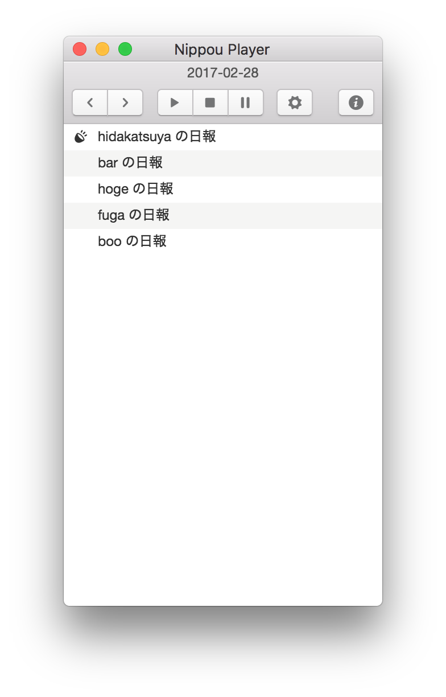

# NIPPOU Player for esa.io

A client for playing NIPPOU in [esa.io](https://esa.io).



## Getting Started

### Installing

Download the latest package from  [Releases](https://github.com/hidakatsuya/nippou-player/releases).

### Setting

Boot application at first, then setting page will be shown. Please set the following settings on the page:

 - Set Access token for esa API
 - Set path to index of NIPPOU(日報) for your esa.io

That's all.

## Contributing

Bug reports and pull requests are welcome on GitHub at https://github.com/hidakatsuya/nippou-player.

## Development

```bash
$ npm install
$ npm run serve or electron:serve
```

## Copyright

2017 &copy; Katsuya HIDAKA. See MIT-LICENSE for further details.
